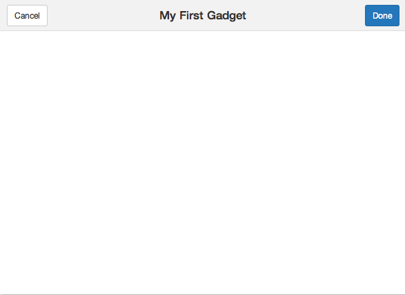
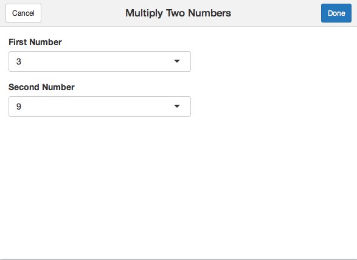
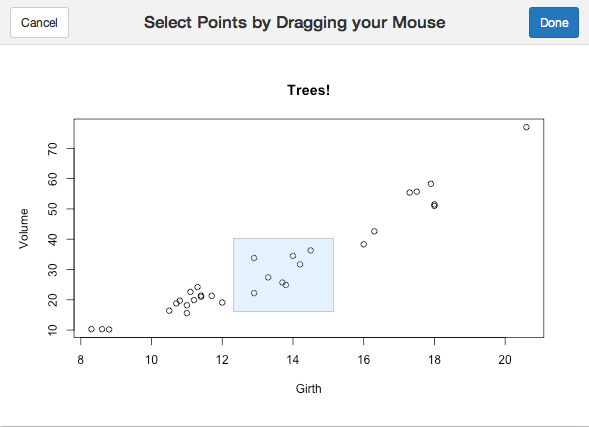

## Introduction

Shiny Gadgets provide a way to use Shiny's interactivity and
user interface tools as a part of a data analysis. With
Shiny Gadgets you can create a function that opens a small 
Shiny app. Since these apps are smaller we'll be using the
miniUI package for creating user interfaces.

## A Simple Gadget

At its core a Shiny Gadget is a function that launches a
small (single-page) Shiny application. Since Shiny Gadgets
are meant to be displayed in the RStudio viewer pane, the
miniUI package comes in handy for its smaller graphical
elements. Let's construct a very simple Shiny Gadget.

## A Simple Gadget: Code

```r
library(shiny)
library(miniUI)

myFirstGadget <- function() {
  ui <- miniPage(
    gadgetTitleBar("My First Gadget")
  )
  server <- function(input, output, session) {
    # The Done button closes the app
    observeEvent(input$done, {
      stopApp()
    })
  }
  runGadget(ui, server)
}
```

## A Simple Gadget: Image



## A Simple Gadget: Code Review

Source the preceding code and run `myFirstGadget()` to see
a very basic Shiny Gadget. Just to review some of the new
functions in this Gadget:

- `miniPage()` creates a small layout.
- `gadgetTitleBar()` provides a title bar with Done and 
Cancel buttons.
- `runGadget()` runs the Shiny Gadget, taking `ui` and
`server` as arguments.

## Gadgets with Arguments

One of the advantages of Shiny Gadgets is that since Shiny
Gadgets are functions they can take values as arguments and
they can return values. Let's take a look at a simple
example of a Shiny Gadget that takes arguments and returns
a value. The following Shiny Gadget takes two different
vectors of numbers as arguments and uses those vectors to
populate two `selectInput`s. The user can then choose two
numbers within the Gadget, and the product of those two
numbers will be returned.

## Gadgets with Arguments: Code Part 1

```r
library(shiny)
library(miniUI)

multiplyNumbers <- function(numbers1, numbers2) {
  ui <- miniPage(
    gadgetTitleBar("Multiply Two Numbers"),
    miniContentPanel(
      selectInput("num1", "First Number", choices=numbers1),
      selectInput("num2", "Second Number", choices=numbers2)
    )
  )
```
## Gadgets with Arguments: Code Part 2

```r
  server <- function(input, output, session) {
    observeEvent(input$done, {
      num1 <- as.numeric(input$num1)
      num2 <- as.numeric(input$num2)
      stopApp(num1 * num2)
    })
  }
  runGadget(ui, server)
}
```

## Gadgets with Arguments: Image



## Gadgets with Arguments: Code Review

Source the preceding code and run 
`multiplyNumbers(1:5, 6:10)` so you
can get a sense of how this Gadget works. As you can see
this Gadget uses `selectInput()` so that the user can
select two different numbers. Clicking the Done button
multiplies the tow numbers together, which is returned as
the result of the `multiplyNumbers()` function.

## Gadgets with Interactive Graphics

Shiny Gadgets are particularly useful when a data analysis
needs a touch of human intervention. You can imagine
presenting an interactive data visualization through a
Gadget, where an analyst could manipulate data in the
Gadget, and then the Gadget would return the manipulated
data. Let's walk though an example of how this could be done.

## Gadgets with Interactive Graphics: Code Part 1

```r
library(shiny)
library(miniUI)

pickTrees <- function() {
  ui <- miniPage(
    gadgetTitleBar("Select Points by Dragging your Mouse"),
    miniContentPanel(
      plotOutput("plot", height = "100%", brush = "brush")
    )
  )
```

## Gadgets with Interactive Graphics: Code Part 2

```r
  server <- function(input, output, session) {
    output$plot <- renderPlot({
      plot(trees$Girth, trees$Volume, main = "Trees!",
        xlab = "Girth", ylab = "Volume")
    })
    observeEvent(input$done, {
      stopApp(brushedPoints(trees, input$brush,
        xvar = "Girth", yvar = "Volume"))
    })
  }

  runGadget(ui, server)
}
```

## Gadgets with Interactive Graphics: Image



## Gadgets with Interactive Graphics: Code Review

Source the preceding code and run `pickTrees()`. Click and
drag a box over the graph. Once you've drawn a box that
you're satisfied with click the Done button and the points
that you selected will be returned to you as a data frame.
This functionality is made possible by the `brushedPoints()`
function, which is part of the `shiny` package. (See 
`?shiny::brushedPoints` for more information.)

## Conclusion

For more details about Shiny Gadgets visit the Shiny Gadgets
website:

- http://shiny.rstudio.com/articles/gadgets.html
- http://shiny.rstudio.com/articles/gadget-ui.html