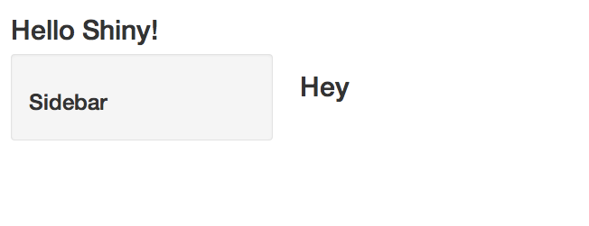
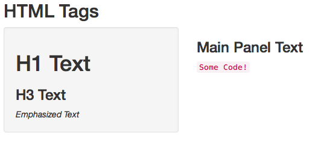
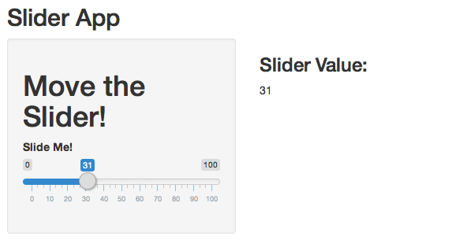
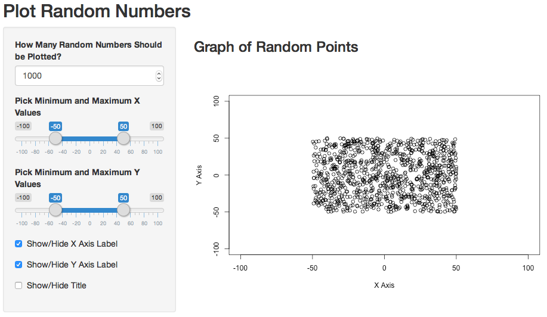

## What is Shiny?

- Shiny is a web application framework for R.
- Shiny allows you to create a graphical interface so that
users can interact with your visualizations, models, and 
algorithms without needed to know R themselves.
- Using Shiny, the time to create simple, yet powerful, 
web-based interactive data products in R is minimized.
- Shiny is made by the fine folks at R Studio.

## Some Mild Prerequisites 

Shiny doesn't really require it, but as with all web 
programming, a little knowledge of HTML, CSS and Javascript
is very helpful.

- HTML gives a web page structure and sectioning as well as markup instructions
- CSS gives the style
- Javscript for interactivity
  
Shiny uses [Bootstrap](http://getbootstrap.com/) (no 
relation to the statistics bootstrap) style, which (to me) 
seems to look nice and renders well on mobile platforms.

## Available Tutorials

If you're interested in learning more about HTML, CSS, and
Javascript we recommend any one of the following resources:

- [Mozilla Developer Network Tutorials](https://developer.mozilla.org/en-US/docs/Web/Tutorials)
- [HTML & CSS from Khan Academy](https://www.khanacademy.org/computing/computer-programming/html-css)
- [Tutorials from Free Code Camp](https://www.freecodecamp.com/)

## Getting Started

- Make sure you have the latest release of R installed
- If on Windows, make sure that you have Rtools installed
- `install.packages("shiny")`
- `library(shiny)`
- Great tutorial at http://shiny.rstudio.com/tutorial/
- Basically, this lecture is walking through that tutorial 
offering some of our insights

## A Shiny project

A shiny project is a directory containing at least two files:

- `ui.R` (for user interface) controls how your app looks.
- `server.R` that controls what your app does.

## ui.R

```r
library(shiny)
shinyUI(fluidPage(
  titlePanel("Data science FTW!"),
  sidebarLayout(
    sidebarPanel(
      h3("Sidebar Text")
    ),
    mainPanel(
      h3("Main Panel Text")
    )
  )
))
```

## server.R

```r
library(shiny)
shinyServer(function(input, output) {

})
```

## To run it
- In R, change to the directories with these files and type `runApp()`
- or put the path to the directory as an argument
- It should open a browser window with the app running

## Your First Shiny App



## HTML Tags in Shiny

Shiny provides several wrapper functions for using
standard HTML tags in your `ui.R`, including `h1()` through
`h6()`, `p()`, `a()`, `div()`, and `span()`.

- See `?builder` for more details.

## R Wrappers for HTML Tags

```r
library(shiny)
shinyUI(fluidPage(
  titlePanel("HTML Tags"),
  sidebarLayout(
    sidebarPanel(
      h1("H1 Text"),
      h3("H3 Text"),
      em("Emphasized Text")
    ),
    mainPanel(
      h3("Main Panel Text"),
      code("Some Code!")
    )
  )
))
```

## App with Many Tags



## App with Inputs and Outputs

Now that you've played around with customizing the look of
your app, let's give it some functionality! Shiny provides
several types of inputs including buttons, checkboxes, text
boxes, and calendars. First let's experiment with the slider
input. This simple app will display the number that is
selected with a slider.

## Slider App: ui.R

```r
library(shiny)
shinyUI(fluidPage(
  titlePanel("Slider App"),
  sidebarLayout(
    sidebarPanel(
      h1("Move the Slider!"),
      sliderInput("slider1", "Slide Me!", 0, 100, 0)
    ),
    mainPanel(
      h3("Slider Value:"),
      textOutput("text")
    )
  )
))
```

## Slider App: server.R

```r
library(shiny)
shinyServer(function(input, output) {
  output$text <- renderText(input$slider1)
})
```

## Slider App



## New Components in the Slider App

### ui.R

- `sliderInput()` specifies a slider that a user can manipulate
- `testOutput()` displays text that is rendered in `server.R`

### server.R

- `renderText()` transforms UI input into text that can be displayed.

## Inputs and Outputs

Notice that in `ui.R` input and output names are assigned
with strings (`sliderInput("slider1",...`, `textOutput("text")`)
and in `server.R` those components can be accessed with the
`$` operator: `output$text <- renderText(input$slider1)`.

## Apps with Plots

Allowing users to manipulate data and to see the results of
their manipulations as a plot can be very useful. Shiny
provides the `plotOutput()` function for `ui.R` and the 
`renderPlot()` function for `sever.R` for taking user input 
and creating plots.

## Plot App: ui.R Part 1

```r
library(shiny)
shinyUI(fluidPage(
  titlePanel("Plot Random Numbers"),
  sidebarLayout(
    sidebarPanel(
      numericInput("numeric", "How Many Random Numbers Should be Plotted?", 
                   value = 1000, min = 1, max = 1000, step = 1),
      sliderInput("sliderX", "Pick Minimum and Maximum X Values",
                  -100, 100, value = c(-50, 50)),
# ...
```

## Plot App: ui.R Part 2

```r
# ...
      sliderInput("sliderY", "Pick Minimum and Maximum Y Values",
                  -100, 100, value = c(-50, 50)),
      checkboxInput("show_xlab", "Show/Hide X Axis Label", value = TRUE),
      checkboxInput("show_ylab", "Show/Hide Y Axis Label", value = TRUE),
      checkboxInput("show_title", "Show/Hide Title")
    ),
    mainPanel(
      h3("Graph of Random Points"),
      plotOutput("plot1")
    )
  )
))
```

## Plot App: server.R Part 1

```r
library(shiny)
shinyServer(function(input, output) {
  output$plot1 <- renderPlot({
    set.seed(2016-05-25)
    number_of_points <- input$numeric
    minX <- input$sliderX[1]
    maxX <- input$sliderX[2]
    minY <- input$sliderY[1]
    maxY <- input$sliderY[2]
# ...
```

## Plot App: server.R Part 2

```r
# ...
    dataX <- runif(number_of_points, minX, maxX)
    dataY <- runif(number_of_points, minY, maxY)
    xlab <- ifelse(input$show_xlab, "X Axis", "")
    ylab <- ifelse(input$show_ylab, "Y Axis", "")
    main <- ifelse(input$show_title, "Title", "")
    plot(dataX, dataY, xlab = xlab, ylab = ylab, main = main,
         xlim = c(-100, 100), ylim = c(-100, 100))
  })
})
```

## Apps with Plots



## Apps with Plots

### ui.R

- `numericInput()` allows the user to enter any number
- `checkboxInput()` creates boxes that can be checked
- `plotOutput()` displays a plot

### server.R

- `renderPlot()` wraps the creation of a plot so it can be displayed

## Next Lecture

- Reactivity
- Advanced UI
- Interactive Graphics

## More about R and the Web
- [OpenCPU](https://public.opencpu.org/) by Jerome Ooms, is a really neat project providing an API for calling R from web documents
