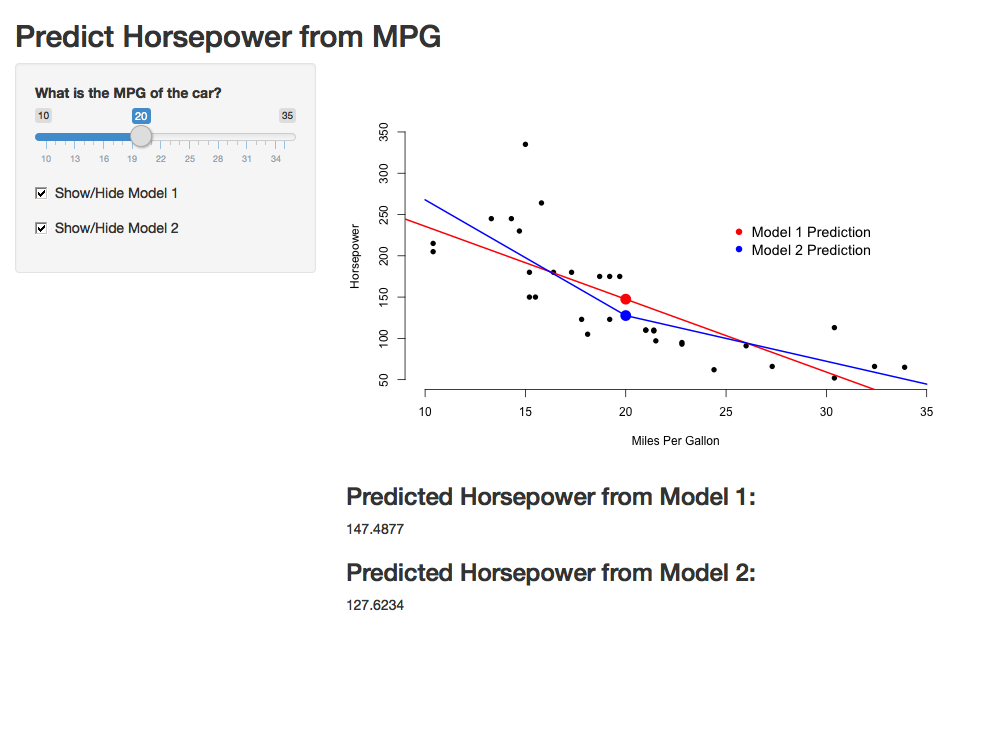
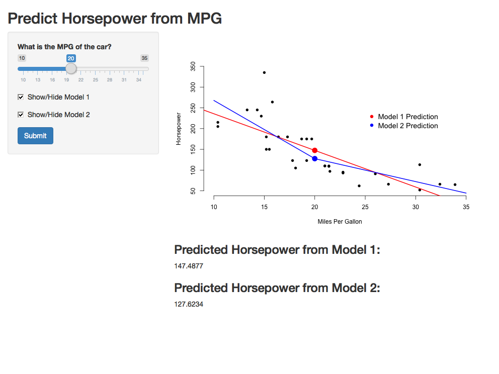
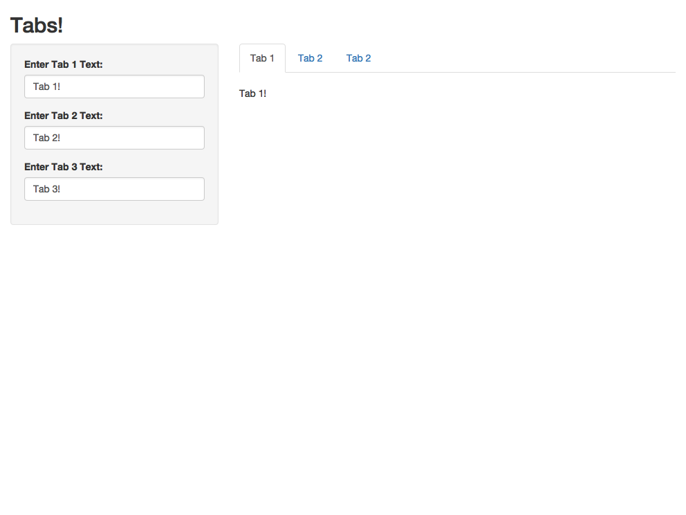
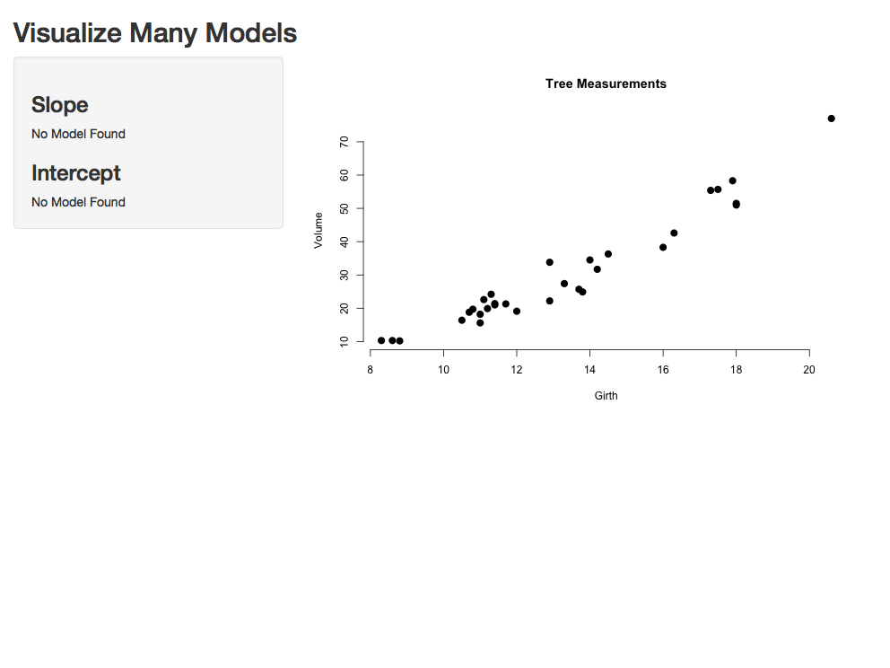

## Reactivity

A reactive expression is like a recipe that manipulates
inputs from Shiny and then returns a value. Reactivity
provides a way for your app to respond since inputs will 
change depending on how users interact with your user 
interface. Expressions wrapped by `reactive()` should be
expressions that are subject to change.

## Reactivity

Creating a reactive expression is just like creating a
function:

```r
calc_sum <- reactive({
  input$box1 + input$box2
})

# ...

calc_sum()
```

## Your First Reactive App

```{r, echo=FALSE}
library(webshot)
appshot("app1", "app1.png")
```

This application predicts the horsepower of a car given
the fuel efficiency in miles per gallon for the car.

## Horsepower Prediction: ui.R Part 1

```r
library(shiny)
shinyUI(fluidPage(
  titlePanel("Predict Horsepower from MPG"),
  sidebarLayout(
    sidebarPanel(
      sliderInput("sliderMPG", "What is the MPG of the car?", 10, 35, value = 20),
      checkboxInput("showModel1", "Show/Hide Model 1", value = TRUE),
      checkboxInput("showModel2", "Show/Hide Model 2", value = TRUE)
    ),
# ...
```

## Horsepower Prediction: ui.R Part 2

```r
# ...
    mainPanel(
      plotOutput("plot1"),
      h3("Predicted Horsepower from Model 1:"),
      textOutput("pred1"),
      h3("Predicted Horsepower from Model 2:"),
      textOutput("pred2")
    )
  )
))
```

## Horsepower Prediction: server.R Part 1

```r
library(shiny)
shinyServer(function(input, output) {
  mtcars$mpgsp <- ifelse(mtcars$mpg - 20 > 0, mtcars$mpg - 20, 0)
  model1 <- lm(hp ~ mpg, data = mtcars)
  model2 <- lm(hp ~ mpgsp + mpg, data = mtcars)
  
  model1pred <- reactive({
    mpgInput <- input$sliderMPG
    predict(model1, newdata = data.frame(mpg = mpgInput))
  })
  
  model2pred <- reactive({
    mpgInput <- input$sliderMPG
    predict(model2, newdata = 
              data.frame(mpg = mpgInput,
                         mpgsp = ifelse(mpgInput - 20 > 0,
                                        mpgInput - 20, 0)))
  })
```

## Horsepower Prediction: server.R Part 2

```r
  output$plot1 <- renderPlot({
    mpgInput <- input$sliderMPG
    
    plot(mtcars$mpg, mtcars$hp, xlab = "Miles Per Gallon", 
         ylab = "Horsepower", bty = "n", pch = 16,
         xlim = c(10, 35), ylim = c(50, 350))
    if(input$showModel1){
      abline(model1, col = "red", lwd = 2)
    }
    if(input$showModel2){
      model2lines <- predict(model2, newdata = data.frame(
        mpg = 10:35, mpgsp = ifelse(10:35 - 20 > 0, 10:35 - 20, 0)
      ))
      lines(10:35, model2lines, col = "blue", lwd = 2)
    }
```

## Horsepower Prediction: server.R Part 3

```r
  legend(25, 250, c("Model 1 Prediction", "Model 2 Prediction"), pch = 16, 
           col = c("red", "blue"), bty = "n", cex = 1.2)
    points(mpgInput, model1pred(), col = "red", pch = 16, cex = 2)
    points(mpgInput, model2pred(), col = "blue", pch = 16, cex = 2)
  })
  
  output$pred1 <- renderText({
    model1pred()
  })
  
  output$pred2 <- renderText({
    model2pred()
  })
})
```

## Horsepower Prediction



## Delayed Reactivity

You might not want your app to immediately react to changes
in user input because of something like a long-running
calculation. In order to prevent reactive expressions from
reacting you can use a submit button in your app. Let's take
a look at last app we created, but with a submit button
added to the app.

```{r, echo=FALSE}
library(webshot)
appshot("app2", "app2.png")
```

## Reactive Horsepower: ui.R

There's one new line added to the code from the last app:

```r
shinyUI(fluidPage(
  titlePanel("Predict Horsepower from MPG"),
  sidebarLayout(
    sidebarPanel(
      sliderInput("sliderMPG", "What is the MPG of the car?", 10, 35, value = 20),
      checkboxInput("showModel1", "Show/Hide Model 1", value = TRUE),
      checkboxInput("showModel2", "Show/Hide Model 2", value = TRUE),
      submitButton("Submit") # New!
    ),
```

## Reactive Horsepower



## Advanced UI

There are several other kinds of UI components that you can
mix into your app including tabs, navbars, and sidebars.
We'll show you an example of how to use tabs to give your app
multiple views. The `tabsetPanel()` function specifies a
group of tabs, and then the `tabPanel()` function specifies
the contents of an individual tab.

```{r, echo=FALSE}
library(webshot)
appshot("app3", "app3.png")
```

## Tabs: ui.R

```r
library(shiny)
shinyUI(fluidPage(
  titlePanel("Tabs!"),
  sidebarLayout(
    sidebarPanel(
      textInput("box1", "Enter Tab 1 Text:", value = "Tab 1!"),
      textInput("box2", "Enter Tab 2 Text:", value = "Tab 2!"),
      textInput("box3", "Enter Tab 3 Text:", value = "Tab 3!")
    ),
    mainPanel(
      tabsetPanel(type = "tabs", 
                  tabPanel("Tab 1", br(), textOutput("out1")), 
                  tabPanel("Tab 2", br(), textOutput("out2")), 
                  tabPanel("Tab 2", br(), textOutput("out3"))
      )
    )
  )
))
```

## Tabs: server.R

```r
library(shiny)
shinyServer(function(input, output) {
  output$out1 <- renderText(input$box1)
  output$out2 <- renderText(input$box2)
  output$out3 <- renderText(input$box3)
})
```

## Tabs



## Interactive Graphics

One of my favorite features of Shiny is the ability to create
graphics that a user can interact with. One method you can
use to select multiple data points on a graph is
by specifying the `brush` argument in `plotOutput()` on the
`ui.R` side, and then using the `brushedPoints()` function on
the `server.R` side. The following example app fits a
linear model for the selected points and then draws a line 
of best fit for the resulting model.

```{r, echo=FALSE}
library(webshot)
appshot("app4", "app4.png")
```

## Interactive Graphics: ui.R

```r
library(shiny)
shinyUI(fluidPage(
  titlePanel("Visualize Many Models"),
  sidebarLayout(
    sidebarPanel(
      h3("Slope"),
      textOutput("slopeOut"),
      h3("Intercept"),
      textOutput("intOut")
    ),
    mainPanel(
      plotOutput("plot1", brush = brushOpts(
        id = "brush1"
      ))
    )
  )
))
```

## Interactive Graphics: server.R Part 1

```r
library(shiny)
shinyServer(function(input, output) {
  model <- reactive({
    brushed_data <- brushedPoints(trees, input$brush1,
                            xvar = "Girth", yvar = "Volume")
    if(nrow(brushed_data) < 2){
      return(NULL)
    }
    lm(Volume ~ Girth, data = brushed_data)
  })
  output$slopeOut <- renderText({
    if(is.null(model())){
      "No Model Found"
    } else {
      model()[[1]][2]
    }
  })
# ...
```

## Interactive Graphics: server.R Part 2

```r
# ...
output$intOut <- renderText({
    if(is.null(model())){
      "No Model Found"
    } else {
      model()[[1]][1]
    }
  })
  output$plot1 <- renderPlot({
    plot(trees$Girth, trees$Volume, xlab = "Girth",
         ylab = "Volume", main = "Tree Measurements",
         cex = 1.5, pch = 16, bty = "n")
    if(!is.null(model())){
      abline(model(), col = "blue", lwd = 2)
    }
  })
})
```

## Interactive Graphics



## Sharing Shiny Apps

Once you've created a Shiny app, there are several ways to
share your app. Using [shinyapps.io](http://www.shinyapps.io/)
allows users to interact with your app through a web browser
without needing to have R or Shiny installed. Shinyapps.io
has a free tier, but if you want to use a Shiny app in your
business you may be interested in paying for the service. If
you're sharing your app with an R user you can post your app
to GitHub and instruct the user to use the `runGist()` or 
`runGitHub()` function to launch your app.

## More Shiny Resources

- [The Official Shiny Tutorial](http://shiny.rstudio.com/tutorial/)
- [Gallery of Shiny Apps](http://shiny.rstudio.com/gallery/)
- [Show Me Shiny: Gallery of R Web Apps](http://www.showmeshiny.com/)
- [Integrating Shiny and Plotly](https://plot.ly/r/shiny-tutorial/)
- [Shiny on Stack Overflow](http://stackoverflow.com/questions/tagged/shiny)