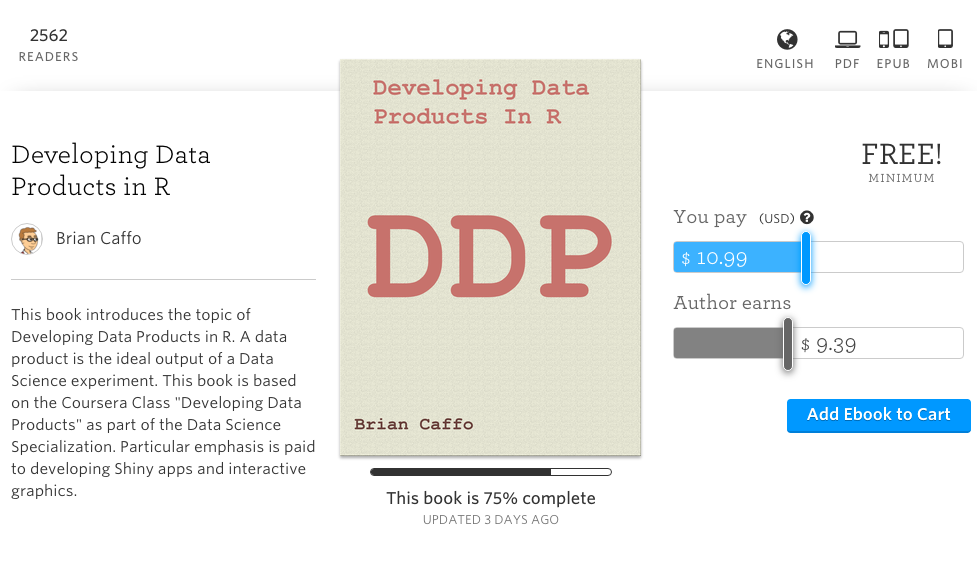

---
---

# [Developing Data Products](index.html)

## Developing Data Products in R

This companion book for the class introduces the topic of Developing Data Products in R. You can get a copy here: https://leanpub.com/ddp

It has variable pricing, including free!

The book is available under variable pricing, including free! It also includes some content (like leaflet) that was not covered in the class and omits some other. It's a little rough, but as I work on it you'll get all of the updates.

---

[**Back to Developing Data Products Home**](index.html)